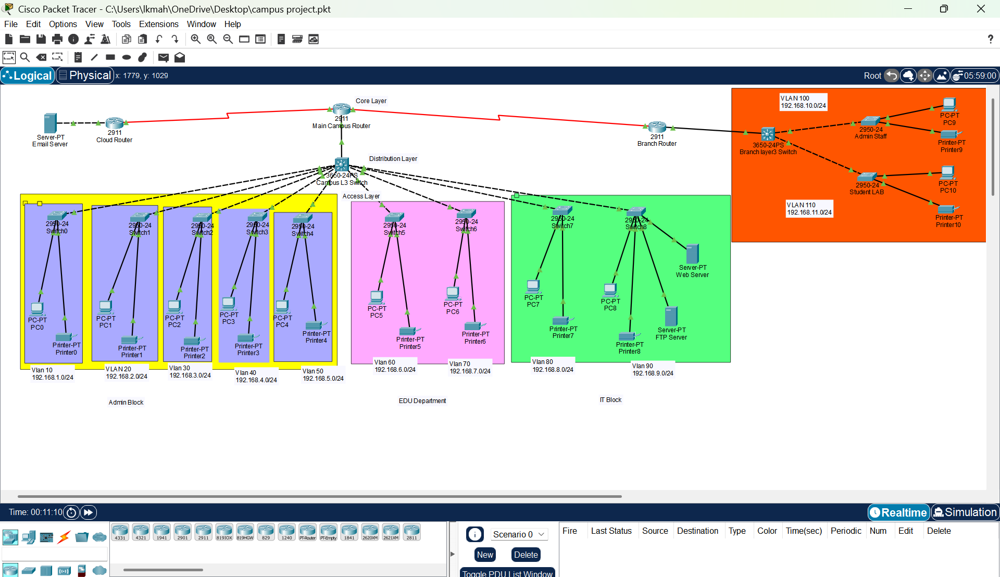
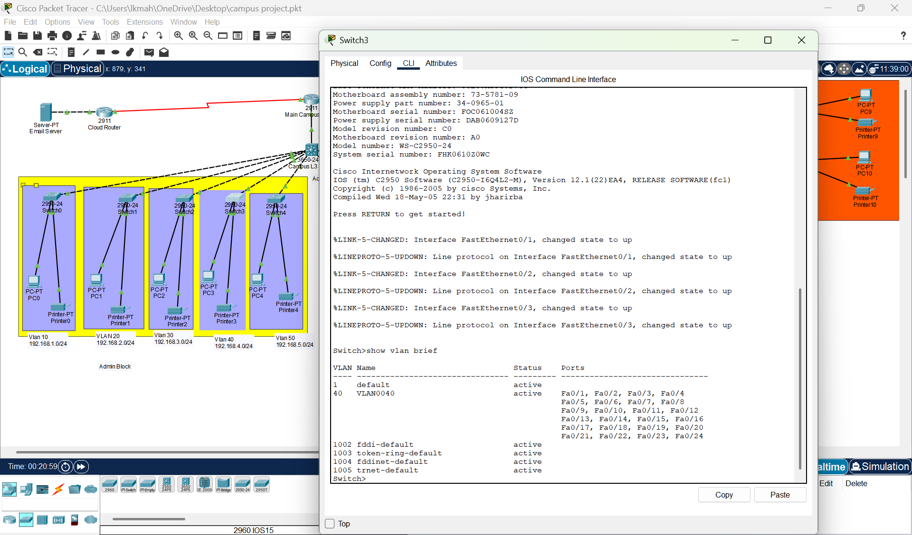
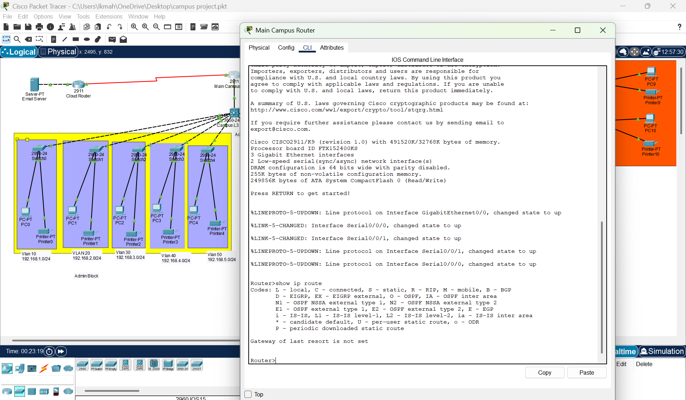
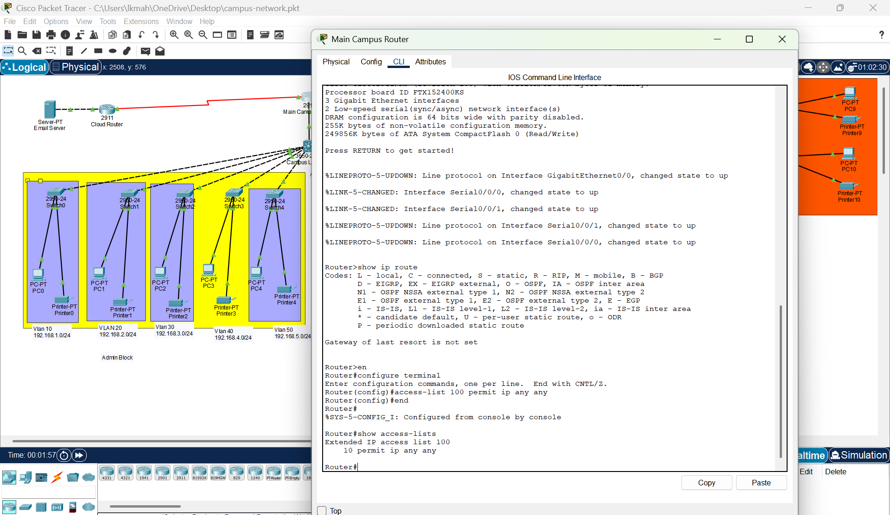
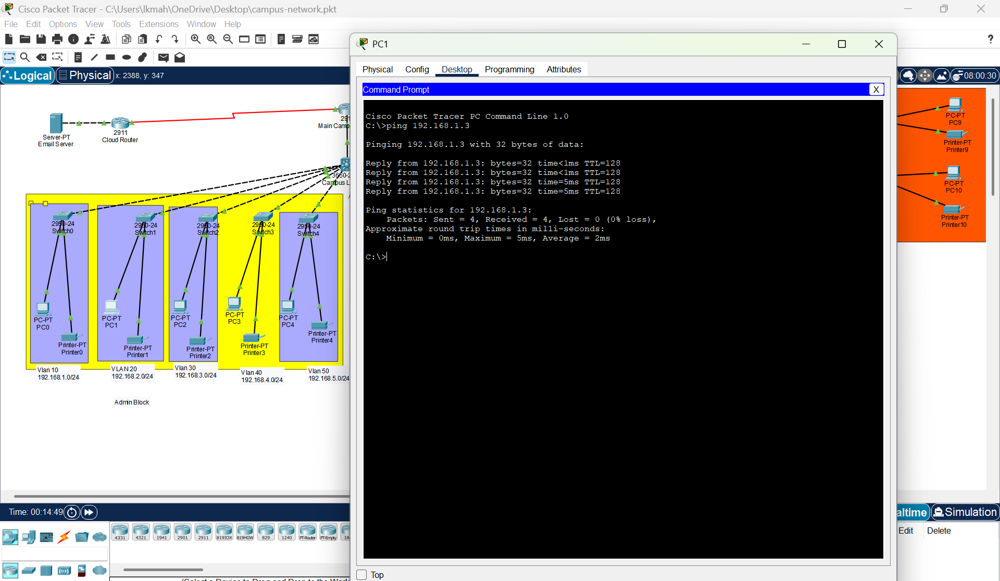

# ccna-campus-network-design
Designed a campus network using VLANs, routing, and security configurations in Cisco Packet Tracer

# CCNA Campus Network Design 🌐

## 📌 Overview
This project demonstrates the design and implementation of a campus network using Cisco Packet Tracer. The network is segmented into multiple departments using VLANs and secured using ACLs, ensuring efficient communication and security.

---

## 🧩 Network Design
- Multi-building campus network
- VLAN-based segmentation for departments
- Inter-VLAN routing using router-on-a-stick
- Dynamic routing using RIP

---

## ⚙️ Technologies Used
- VLANs
- Trunking
- Inter-VLAN Routing
- RIP (Routing Information Protocol)
- DHCP & DNS
- ACL (Access Control Lists)
- SSH (Secure Remote Access)

---

## 🚀 Implementation Steps

1. Designed network topology with routers, switches, and end devices  
2. Created VLANs for different departments (HR, Finance, IT, Student, Faculty, Guest, Management, Servers)  
3. Configured trunk ports between switches  
4. Implemented inter-VLAN routing using sub-interfaces  
5. Configured RIP for dynamic routing  
6. Applied ACLs for network security  
7. Configured DHCP for automatic IP assignment  
8. Configured DNS for hostname resolution  
9. Enabled SSH for secure device access  
10. Tested connectivity using ping and traceroute  

---

## 🔐 Security
- Applied ACL rules to restrict inter-department access  
- Enabled SSH authentication for secure remote login  

---

## 🧩 Network Topology

---

## 📸 Screenshots
### VLAN Configuration

Configured VLANs for different departments.

---

### Routing Table

Configured routing between networks.

---

### ACL Configuration

Applied access control lists for security.

---

### Connectivity Test

Verified connectivity using ping (0% packet loss).

---

## 📁 Project File
[Download Packet Tracer File](campus-network.pkt)
